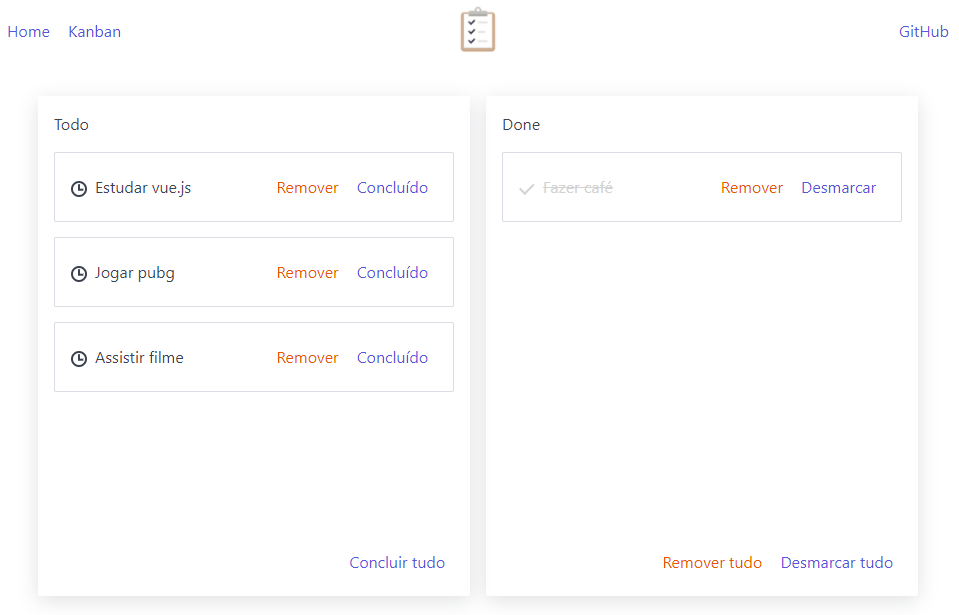

<h1 align="center">
  
</h1>

<h3 align="center">
  Criando uma aplicação de todos (criar tarefa, marcar/desmarcar a tarefa como concluída e remover tarefa) com Vue.js
</h3>

<p align="center">
  <a href="https://www.youtube.com/playlist?list=PLp7Agl_Dsq-xkB8iOTb3yTrfYpH6rDQL8">Curso Iniciante</a>
</p>

<p align="center">Por Switch Case</p>

<p align="center">
  <a href="#como-executar-o-projeto">Como executar o projeto</a>&nbsp;&nbsp;&nbsp;|&nbsp;&nbsp;&nbsp;
  <a href="#anotações">Anotações</a>
</p>

<p align="center">Front-end</p>

<p align="center">
  
</p>

## Como executar o projeto

### Requisitos

- [Node.js](https://nodejs.org)

### Clonar este repositório

```bash
git clone https://github.com/eliasmcastro/switch-case-youtube-todo-vuejs.git
```

### Executar

- `cd switch-case-youtube-todo-vuejs` para entrar na pasta
- `npm install` para instalar as dependências do projeto
- `npm run serve` para iniciar o servidor de desenvolvimento
- Acessar http://localhost:8080

## Anotações

### Ambiente de desenvolvimento

- [Node.js & NPM](https://nodejs.org)
  - O Node.js deve ser instalado via [package manager](https://nodejs.org/en/download/package-manager) utilizando o Chocolatey no Windows
    - Instalar o [Chocolatey](https://chocolatey.org/install)
    - Executar `cinst nodejs-lts` para instalar o Node.js
    - Executar `node -v` e `npm -v` para verificar se a instalação deu certo
- [Visual Studio Code](https://code.visualstudio.com)
  - Instalar o Visual Studio Code
  - Extensões
    - Tema do Dracula Official
    - Material Icon Theme
    - Vetur
  - Fontes
    - [Fira Code](https://github.com/tonsky/FiraCode)
- [Vue CLI](https://cli.vuejs.org)
  - O Vue CLI é um sistema completo para o desenvolvimento rápido de Vue.js
  - Para realizar a instalação, execute `npm install -g @vue/cli`

### Criando um projeto

- Executar `vue create nomeprojeto` para criar o o projeto
  - A pasta public é onde fica todos os arquivos acessíveis pelos usuários finais
  - A pasta src é onde fica todo o código da nossa aplicação
  - O arquivo package.json serve para guardar as informações de versões das dependências do projeto
- Executar `npm run serve` para inicializar o servidor em http://localhost:8080
